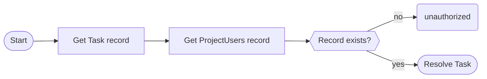

# 4. Authorization

## 4.1. Limit writing privileges to administrators.

In our current situation, any user is capable of create, updating and deleting tasks and projects. But what if we wanted to only allow some users (i.e. admins) to operate those operations?

First, let’s create a new group in Cognito named `Admin`

Go to the [Amazon Cognito AWS console](https://us-east-1.console.aws.amazon.com/cognito/v2/idp/user-pools?region=us-east-1), and select the user pool relative to our API.

Under `Group`, click the `Create Group` button. Give it a name: `Admins`, and hit _save._

Create a new user, using the same two commands as in the [previous section](https://www.notion.so/3-Testing-d6f7c0dc7c734e25946375f2dfe6f3a5?pvs=21).

Finally, add the user to the group using the AWS console.

When you are done, open the schema file: `schema/schema.graphql`. Change the `Mutation` definition as follows.

```graphql
type Mutation {
  createTask(input: CreateTaskInput!): Task!
    @aws_auth(cognito_groups: ["Admins"])
  updateTask(input: UpdateTaskInput!): Task!
    @aws_auth(cognito_groups: ["Admins"])
  deleteTask(id: ID!): Task! @aws_auth(cognito_groups: ["Admins"])
  createProject(input: CreateProjectInput!): Project!
    @aws_auth(cognito_groups: ["Admins"])
  updateProject(input: UpdateProjectInput!): Project!
    @aws_auth(cognito_groups: ["Admins"])
  deleteProject(id: ID!): Project! @aws_auth(cognito_groups: ["Admins"])
  addUserToProject(input: AddUserToProjectInput!): ProjectUser!
    @aws_auth(cognito_groups: ["Admins"])
}
```

Here, we make use of the `@aws_auth` directive, which specifies that only users in the `Admin` group are allowed to invoke

Time to deploy again.

```bash
npx sls deploy
```

When the deployment is done, try to create, update or delete a Task using your initial user. You should observe that it fails.

```json
{
  "data": null,
  "errors": [
    {
      "path": ["createTask"],
      "data": null,
      "errorType": "Unauthorized",
      "errorInfo": null,
      "locations": [
        {
          "line": 2,
          "column": 3,
          "sourceName": null
        }
      ],
      "message": "Not Authorized to access createTask on type Mutation"
    }
  ]
}
```

Then, try to login using your admin user. This time ,you should be allowed to perform the action.

## 4.2. Limit tasks to Project users

Now that only admins can perform write operations on tasks, we would like limit users from seeing tasks only for projects they are in.

In this case, we cannot use a directive since projects are not the same as groups. Projects and user relations live in DynamoDB.

To achieve our goal, we can use pipeline resolvers.

Pipeline resolvers are a special kind of resolver that allows for connecting to more than one data source. Each pipeline resolver is composed of up to 10 functions that are executed in a sequence.

In our case, we want to first fetch a Task, extract its `projectId`, and then verify that the user is in that project by looking in the `ProjectUsers` table if a relation record exists.



Open the `src/definitions/appsync.ts` file, and add the following code inside the `appSync` definition object.

```tsx
pipelineFunctions: {
  authorizeUser: {
    dataSource: 'projectUsers',
    code: 'src/resolvers/authorizeUser.ts',
  },
 },
```

This defines a pipeline function. It uses the `projectUsers` data source which connects to the DynamoDb table of the same name.

Now, create the following file `src/resolvers/authorizeUser.ts`

```
import { Context, util, runtime } from '@aws-appsync/utils';
import { get } from '@aws-appsync/utils/dynamodb';
import { DBProjectUser } from '../types/db';
import { isCognitoIdentity } from '../utils';

export const request = (ctx: Context) => {
  if (!isCognitoIdentity(ctx.identity)) {
    util.unauthorized();
  }

  if (ctx.identity.groups?.includes('Admins')) {
    runtime.earlyReturn(ctx.prev.result);
  }

  return get<DBProjectUser>({
    key: {
      projectId: ctx.prev.result.projectId,
      username: ctx.identity.username,
    },
  });
};

export const response = (ctx: Context) => {
  if (!ctx.result) {
    util.unauthorized();
  }

  return ctx.prev.result;
};
```

A pipeline resolver looks exactly like a normal (unit) resolver. In the above code, we generate a `GetItem` request to DynamoDB by using the `proejctId` from the task and the `username` of the current user.

We also do a few more pre-checks:

First, we use `isCognitoIdentity`, a custom function that I created. It serves two purposes.

1. It makes sure that the current request is invoked using a Cognito user. Since, AppSync supports more than one authorizer, we need to make sure that we are using Cognito before we proceed. If it’s not the case, we always reject the request with `unauthorized()`
2. It serves as a TypeScript type guard by making sure that `ctx.identity` is of type `AppSyncIdentityCognito`. This avoids TypeScript from complaining that `username` might not exist.

We also check that the current user is not in the admin group. If the user is an admin, we always want the request to proceed. In this case, we make use of the `runtime.earlyReturn()` function. This function allows us to shortcircuit the current resolver invocation and **\*\*\*\***skip**\*\*\*\*** the datasource request In our case, it mens that the `GetItem` request to DynamoDB will not happen at all.

Finally, if the request proceeds (i.e. the user is not an admin), we check if an item was returend from DynamoDB. If this is the case, it means that the user belongs to the project, so we return `ctx.prev.result` . In other words, we return the result from the _previous_ resolver, which is our “Get Task” resolver. And this is what will be returned to the client.

On the other hand, if no result is found (the user does not belong to the project), we return an `unauthorized` error.

We now have our authorizer pipeline function, but we still need to use it.

Update the `getTask` and `listTasks` resolvers `definitions/appsync.ts` as follow:

```tsx
'Query.getTask': {
  kind: 'PIPELINE',
  functions: [
    {
      dataSource: 'tasks',
      code: 'src/resolvers/Query.getTask.ts',
    },
    'authorizeUser',
  ],
},
'Query.listTasks': {
  kind: 'PIPELINE',
  code: 'src/resolvers/Query.listTasks.ts',
  functions: [
    'authorizeUser',
    {
      dataSource: 'tasks',
      code: 'src/resolvers/listTasks.ts',
    },
  ],
},
```

What we did is to transform the unit resolvers into pipeline resolvers. We introduced the `authorizeUser` pipeline function.

Under `getTask`, the autorization happens after fetching the task, because we first need to task entity to read the `projectId` from it. On the other hand, the `listTasks` query, comes with the `projectId` in the `[ctx.args.id](http://ctx.args.id)`, so we immediately check the authorzation before we even try to read the tasks from the table.

We also need to rename `src/resolvers/Query.listTasks.ts` to `rc/resolvers/listTasks.ts` , and create a new `src/resolvers/Query.listTasks.ts` with the following content:

```tsx
import { Context } from '@aws-appsync/utils';
import { QueryListTasksArgs } from '../types/schema';

export const request = (ctx: Context<QueryListTasksArgs>) => {
  return {
    projectId: ctx.args.projectId,
  };
};

export const response = (ctx: Context) => {
  return ctx.result;
};
```

What happens here is that re created a before resolver. A before resolver does not connect to any data source, but is there to pre-process the incoming request from graphql. We use it in order to extract the project id from the arguments, and pass it to the next resolver (`authorizeUser`).

\***\*\*\*\*\*\*\***Note:\***\*\*\*\*\*\*\***

There are two eays to define a pipeline function in the serverless framework. One is to define it in `pipelineFunctions`, which is what we did earlier with `authorizeUser`. This is a way to create re-useable functions.

The other one is to define it inline in the `functions` array. This is useful if the function is unique and you know it will not be reused.

> **Pro Tip**: \***\*\*\*\*\***\*\*\*\*\***\*\*\*\*\***As a rule of thumb, I highly recommend to always create pipeline resolvers, even if you only have one function in the pipeline. This makes it a lot easier to add a new function if you need to later on without doing complex refactoring.

Pipeline resolver with one function. This is perfectly valid and would have made adding `authorizeUser` a lot easier.

```tsx
'Query.listTasks': {
  kind: 'PIPELINE',
  functions: [
    {
      dataSource: 'tasks',
      code: 'src/resolvers/getTask.ts',
    },
  ],
},
```

Now, deploy the API again.

```bash
npx sls deploy
```

Use your non-admin user to test the `getTask` and `listTasks` operations.

```graphql
query ListTasks {
  # Change the proejct id with your own project id
  listTasks(projectId: "1d49e592-e489-43cc-8ce5-d7d99a731cc4") {
    items {
      id
      title
      description
      priority
      status
      createdAt
      updatedAt
      assignees
    }
    nextToken
  }
}
```

You should get an error.

```json
{
  "data": null,
  "errors": [
    {
      "path": ["listTasks"],
      "data": null,
      "errorType": "Unauthorized",
      "errorInfo": null,
      "locations": [
        {
          "line": 2,
          "column": 3,
          "sourceName": null
        }
      ],
      "message": "Not Authorized to access listTasks on type Query"
    }
  ]
}
```

Switch to your admin user, and add the non-admin user to the project.

```graphql
mutation AddUserToProject {
  addUserToProject(
    input: {
      projectId: "1d49e592-e489-43cc-8ce5-d7d99a731cc4"
      username: "ben"
    }
  ) {
    username
    createdAt
  }
}
```

Then switch back to the non-admin user again and try executing the `getTask` and `listTasks` queries. This time, you should get access to the resources.
