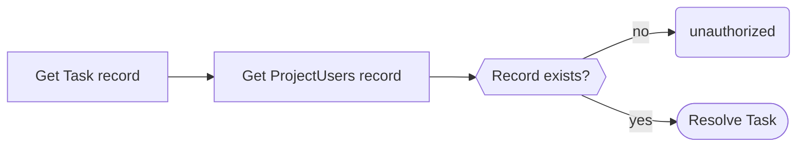

import pipelineResolver from './pipeline-resolver.png';

# 4. Authorization

## 4.1. Limit Write Privileges to Admins

In our current situation, any user is capable of creating, updating and deleting tasks and projects. But what if we wanted to only allow some users (i.e. admins) to execute those actions?

Open the schema file: `schema/schema.graphql`. Change the `Mutation` definition as follows.

```graphql
type Mutation {
  createTask(input: CreateTaskInput!): Task!
    @aws_auth(cognito_groups: ["Admins"])
  updateTask(input: UpdateTaskInput!): Task!
    @aws_auth(cognito_groups: ["Admins"])
  deleteTask(id: ID!): Task! @aws_auth(cognito_groups: ["Admins"])
  createProject(input: CreateProjectInput!): Project!
    @aws_auth(cognito_groups: ["Admins"])
  updateProject(input: UpdateProjectInput!): Project!
    @aws_auth(cognito_groups: ["Admins"])
  deleteProject(id: ID!): Project! @aws_auth(cognito_groups: ["Admins"])
  addUserToProject(input: AddUserToProjectInput!): ProjectUser!
    @aws_auth(cognito_groups: ["Admins"])
}
```

Here, we make use of the `@aws_auth` directive, which specifies that only users in the Cognito `Admin` group are allowed to call these mutations.

Finally, deploy the API again.

```bash
npx sls deploy
```

When the deployment is done, try to create, update or delete a Task. You should observe that it fails with an `Unauthorized` error.

```json
{
  "data": null,
  "errors": [
    {
      "path": ["createTask"],
      "data": null,
      "errorType": "Unauthorized",
      "errorInfo": null,
      "locations": [
        {
          "line": 2,
          "column": 3,
          "sourceName": null
        }
      ],
      "message": "Not Authorized to access createTask on type Mutation"
    }
  ]
}
```

Now, let's create a new group in Cognito named `Admins`.

Go to the [Amazon Cognito AWS console](https://us-east-1.console.aws.amazon.com/cognito/v2/idp/user-pools?region=us-east-1), and select the user pool relative to our API.

Under _Group_, click the _Create Group_ button. Give it a name: `Admins`, and hit _save._

Create a new user, using the same two commands as in the [previous section](./testing#31-create-a-user-in-cognito).

Finally, add the user to the group using the AWS console. Open the user and click on _Add user to group_. Pick the `Admins` group.

Then, try to login using your new user, and execute the mutation again. This time, you should be allowed to perform the action.

## 4.2. Limit Tasks to Project Users

Now that only admins can perform write operations on tasks, we would also like to prevent users from seeing tasks of projects they are not in.

In this case, we cannot use a directive. Projects and user associations live in DynamoDB, so we will have to write the logic ourselves.

To achieve our goal, we can use pipeline resolvers.

Pipeline resolvers are a special kind of resolver that allow for connecting to more than one data source. Each pipeline resolver is composed of up to 10 functions that are executed in a sequence.


In our case, we want to first fetch a Task, extract its `projectId`, and then verify that the user is in that project by looking in the `ProjectUsers` table if a relation record exists. If the record exists, it means that the user is in the project. If not, we disallow the request by throwing an `unauthorized` error.



Open the `src/definitions/appsync.ts` file, and add the following code inside the `appSync` definition object.

```tsx
pipelineFunctions: {
  authorizeUser: {
    dataSource: 'projectUsers',
    code: 'src/resolvers/authorizeUser.ts',
  },
},
```

This defines a pipeline function. It uses the `projectUsers` data source which connects to the DynamoDB table of the same name.

Now, create the following file `src/resolvers/authorizeUser.ts`

```tsx showLineNumbers
import { Context, util, runtime } from '@aws-appsync/utils';
import { get } from '@aws-appsync/utils/dynamodb';
import { DBProjectUser } from '../types/db';
import { isCognitoIdentity } from '../utils';

export const request = (ctx: Context) => {
  // highlight-start
  if (!isCognitoIdentity(ctx.identity)) {
    util.unauthorized();
  }
  // highlight-end

  // highlight-start
  if (ctx.identity.groups?.includes('Admins')) {
    runtime.earlyReturn(ctx.prev.result);
  }
  // highlight-end

  return get<DBProjectUser>({
    key: {
      projectId: ctx.prev.result.projectId,
      username: ctx.identity.username,
    },
  });
};

export const response = (ctx: Context) => {
  // highlight-start
  if (!ctx.result) {
    util.unauthorized();
  }

  return ctx.prev.result;
  // highlight-end
};
```

A pipeline resolver function looks exactly like a unit resolver. In the above code, we generate a `GetItem` request to DynamoDB by using the `projectId` from the task (`ctx.prev.result.projectId`) and the `username` of the current user.

We also do a few more pre-checks:

On lines 7-9, we use `isCognitoIdentity`, a custom function that I created. It serves two purposes.

1. It makes sure that the current request is invoked using a Cognito user. Since, AppSync supports more than one authorizer, we need to make sure that the current request is authorized by Cognito before we proceed. If it's not the case, we always reject the request with `unauthorized()`
2. It serves as a TypeScript type guard by making sure that `ctx.identity` is of type `AppSyncIdentityCognito`. This avoids TypeScript from complaining that `username` might not exist.

On lines 11-13, we also check that the current user is not in the `Admins` group. If the user is an admin, we always want the request to proceed and we don't care if the user belongs to the project or not. For that, we make use of the `runtime.earlyReturn()` function. This function allows us to short-circuit the current resolver invocation and **skip** the data source request. It means that the `GetItem` request to DynamoDB will not happen at all and the _response_ handler is also not called. The value in passed to `earlyReturn()` is the value passed on to the next resolver in the pipeline, or as the GraphQL response if it's the last one in line.

Finally, on line 24-26, we check if an item was returned from DynamoDB. If no result is found, the user does not belong to the project, so we return an `unauthorized` error. Otherwise, we return `ctx.prev.result`. In other words, we return the result from the _previous_ resolver, which is our “Get Task” resolver. This is what will be returned to the client.

We now have our authorizer function, but we still need to use it.

Update the `getTask` and `listTasks` resolvers `definitions/appsync.ts` as follow:

```tsx showLineNumbers
'Query.getTask': {
  kind: 'PIPELINE',
  functions: [
    {
      dataSource: 'tasks',
      code: 'src/resolvers/Query.getTask.ts',
    },
    'authorizeUser',
  ],
},
'Query.listTasks': {
  kind: 'PIPELINE',
  code: 'src/resolvers/Query.listTasks.ts',
  functions: [
    'authorizeUser',
    {
      dataSource: 'tasks',
      code: 'src/resolvers/listTasks.ts',
    },
  ],
},
```

What we did is to transform the unit resolvers into pipeline resolvers, and we introduced the `authorizeUser` pipeline function.

Under `getTask`, the authorization happens after fetching the task, because we first need the task entity so we can read the `projectId` from it. On the other hand, the `listTasks` query, comes with the `projectId` in `ctx.args.id`, so we immediately check the authorization before we even try to read the tasks from the table.

We also need to rename `src/resolvers/Query.listTasks.ts` to `src/resolvers/listTasks.ts` , and create a new `src/resolvers/Query.listTasks.ts` with the following content:

```tsx showLineNumbers
import { Context } from '@aws-appsync/utils';
import { QueryListTasksArgs } from '../types/schema';

export const request = (ctx: Context<QueryListTasksArgs>) => {
  return {
    projectId: ctx.args.projectId,
  };
};

export const response = (ctx: Context) => {
  return ctx.result;
};
```

What happens here is that we created a _before pipeline resolver_ (`request`). A _before pipeline resolver_ does not connect to any data source, but is there to pre-process the incoming request from GraphQL. It is executed before the very first function in the pipeline. We use it in order to extract the project id from the arguments, and pass it to the next resolver (`authorizeUser`).

There is also an _after pipeline resolver_ (`response`) that happens after all the functions been executed. Here, we just return the result from the last function.

To learn more about pipeline resolvers, check the [documentation](https://docs.aws.amazon.com/appsync/latest/devguide/resolver-reference-overview-js.html#anatomy-of-a-pipeline-resolver-js).

:::note
There are two ways to define a pipeline function in the serverless framework. One is to define it in `pipelineFunctions`, which is what we did earlier with `authorizeUser`. This is a way to create re-useable functions.

The other one is to define it inline in the `functions` array. This is useful if the function is unique and you know it will not be reused. This is what we did with `src/resolvers/listTasks.ts`
:::

:::tip
As a rule of thumb, I highly recommend to always create pipeline resolvers, even if you only have one function in the pipeline. This makes it a lot easier to add a new function without doing complex refactoring if you need to later.

```tsx
'Query.listTasks': {
  kind: 'PIPELINE',
  functions: [
    {
      dataSource: 'tasks',
      code: 'src/resolvers/getTask.ts',
    },
  ],
},
```

:::

Now, deploy the API again.

```bash
npx sls deploy
```

Use your non-admin user to test the `getTask` and `listTasks` operations.

```graphql
query ListTasks {
  # Change the project id with your own project id
  listTasks(projectId: "1d49e592-e489-43cc-8ce5-d7d99a731cc4") {
    items {
      id
      title
      description
      priority
      status
      createdAt
      updatedAt
      assignees
    }
    nextToken
  }
}
```

You should get an error.

```json
{
  "data": null,
  "errors": [
    {
      "path": ["listTasks"],
      "data": null,
      "errorType": "Unauthorized",
      "errorInfo": null,
      "locations": [
        {
          "line": 2,
          "column": 3,
          "sourceName": null
        }
      ],
      "message": "Not Authorized to access listTasks on type Query"
    }
  ]
}
```

Switch to your admin user, and use `addUserToProject` mutation to add that user to the project.

```graphql
mutation AddUserToProject {
  addUserToProject(
    input: {
      projectId: "1d49e592-e489-43cc-8ce5-d7d99a731cc4"
      username: "ben"
    }
  ) {
    username
    createdAt
  }
}
```

Then switch back to the non-admin user again and try executing the `getTask` and `listTasks` queries again. This time, you should get access to the resources.
