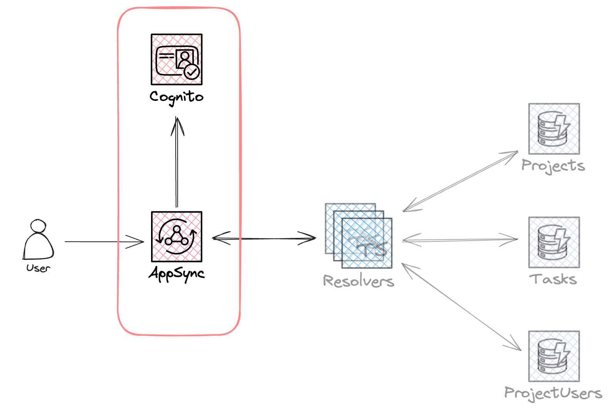

# 1. Defining the Stack

We will start by defining the basic resources for our API: the API itself and the Cognito User Pool.



## 1.1. AppSync API

Our stack uses the [serverless-appsync-plugin](https://github.com/sid88in/serverless-appsync-plugin). Let’s start by adding the required definitions for our API. We will give our API a name, a schema and a default authentication method.

Open the `definitions/appsync.ts` file and add the following code under _`1.1. Define the AppSync API`_

```tsx showLineNumbers
name: 'AppSync Workshop',
schema: 'schema/schema.graphql',
authentication: {
  type: 'AMAZON_COGNITO_USER_POOLS',
  config: {
    userPoolId: {
      Ref: 'CognitoUserPool',
    },
  },
},
dataSources: {},
resolvers: {},
```

## 1.2. Cognito User Pool

Our API uses a Cognito User Pool as its default authorizer (lines 3-10 in the API definition). Let’s define it too.

In `definitions/cognito.ts`, add this code.

```tsx showLineNumbers
// 1.2. Define the Cognito User Pool
CognitoUserPool: {
  Type: 'AWS::Cognito::UserPool',
  Properties: {
    UserPoolName: 'AWS AppSync Workshop User Pool',
    AutoVerifiedAttributes: ['email'],
  },
},
CognitoUserPoolClient: {
  Type: 'AWS::Cognito::UserPoolClient',
  Properties: {
    ClientName: 'AWS AppSync Workshop Client',
    UserPoolId: {
      Ref: 'CognitoUserPool',
    },
    ExplicitAuthFlows: [
      'ALLOW_USER_PASSWORD_AUTH',
      'ALLOW_USER_SRP_AUTH',
      'ALLOW_REFRESH_TOKEN_AUTH',
    ],
  },
},
```

This will create a Cognito User Pool and a User Pool Client.

## 1.3. First deployment

We have defined our API and Cognito user pool. It’s now time for our first deployment.

Run the following command.

```shell
npx sls deploy
```

If everything went well, you should see an output similar to this:

```shell
Deploying appsync-typescript-workshop to stage dev (us-east-1)

✔ Service deployed to stack appsync-typescript-workshop-dev (92s)

appsync endpoints:
  // highlight-next-line
  graphql: https://xbtmamhhkzfm7oudu7z4mvk5ti.appsync-api.us-east-1.amazonaws.com/graphql
  realtime: wss://xbtmamhhkzfm7oudu7z4mvk5ti.appsync-realtime-api.us-east-1.amazonaws.com/graphql
```

The output also gives us information about the deployed API, such as its endpoints. You might want to copy the `graphql` endpoint and keep it somewhere for later.
