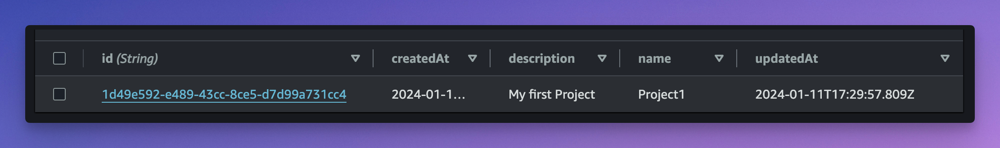

# 3. Testing

## 3.1. Create a User in Cognito

We should now have a fully working API. Let's test it, but for that we need a user to authenticate with.

To do so, connect to the AWS console, and go to [Amazon cognito](https://us-east-1.console.aws.amazon.com/cognito/v2/idp/user-pools).

Open the Cognito user pool name `AWS AppSync Workshop User Pool` and go to _App Integrations_. Under _App clients and analytics_, copy the clientId of the `AWS AppSync Workshop Client`.

Then execute this command, replace the following values:

- `clientId` The client id you copied in Amazon Cognito
- `username` Pick a name for your user
- `password` Pick a password. Passwords must contain at least 8 characters, have at leat one number, one lowercase character, one uppercase character and one special character.
- `email` the email address of your user. The email must be real and valid. You will need to validate it in the following step.

```bash
aws cognito-idp sign-up --client-id "{clientId}" --username "{username}" --password "{password}" --user-attributes Name=email,Value="{email}"
```

example

```bash
aws cognito-idp sign-up --client-id "3un93evcbfcc87jdp6jfc94ig0" --username "ben" --password "AppSync101!" --user-attributes Name=email,Value="ben@example.com"
```

```json
{
  "UserConfirmed": false,
  "CodeDeliveryDetails": {
    "Destination": "b***@g***",
    "DeliveryMedium": "EMAIL",
    "AttributeName": "email"
  },
  "UserSub": "de42fece-e9c5-4c89-933e-7647ef8aa1f9"
}
```

You should immediately receive an email with a verification code. Copy the code and execute the following command. Again, replace the appropriate values.

```bash
aws cognito-idp confirm-sign-up --client-id "{clientId}" --username "{username}" --confirmation-code {verificationCode}
```

If the command does not return any error, it means it worked as expected.

## 3.2. Test Queries and Mutations

Now that you have a user, it’s time to try a few Queries and Mutations. For that, you can use the GraphQL client of your choice (e.g. Postman), but I invite you to use [GraphBolt](https://graphbolt.dev). GraphBolt is a desktop app that helps developers build, test and debug AWS AppSync APIs. It comes with a GraphQL client that is specially tailored for AWS AppSync.

If you prefer, you can also use the [AWS AppSync console](https://us-east-1.console.aws.amazon.com/appsync/home?region=us-east-1#/apis). Open the created API and go to the _Queries_ tab.

Since we are starting from scratch, we don’t have any data in our Database. Let’s start by creating a Project first.

Login with your username and password. if you are using GraphBolt, you can do so by clicking on the padlock icon on the top right ([see documentation](https://docs.graphbolt.dev/graphql-client/authentication)). From the AWS AppSync console, click on **Login with User Pool**. In both cases, you will need to select the user pool, client and enter your username and password.

Execute the following request.

```graphql
mutation CreateProject {
  createProject(input: { name: "Project1", description: "My first Project" }) {
    id
    name
    description
    createdAt
    updatedAt
  }
}
```

If everything went well, you should see a result like this one:

```json
{
  "data": {
    "createProject": {
      "id": "1d49e592-e489-43cc-8ce5-d7d99a731cc4",
      "name": "Project1",
      "description": "My first Project",
      "createdAt": "2024-01-11T17:29:57.809Z",
      "updatedAt": "2024-01-11T17:29:57.809Z"
    }
  }
}
```

Now, go to DynamoDB, and open the `Projects` table. (its name should be `appsync-typescript-workshop-dev-projects`). You should see that the item was persisted.



Do the same, and create a new Task. Don’t forget to replace `projectId` with the id of the project that was previously created. Also replace `ben` with your own username in `assignees`.

```graphql
mutation CreateTask {
  createTask(
    input: {
      title: "Task 1"
      description: "My first task"
      priority: 10
      status: TODO
      projectId: "1d49e592-e489-43cc-8ce5-d7d99a731cc4"
      assignees: ["ben"]
    }
  ) {
    id
    title
    description
    priority
    status
    createdAt
    updatedAt
    assignees
  }
}
```

```json
{
  "data": {
    "createTask": {
      "id": "ef01da5e-79fd-4e56-97f0-e755f7b82d8c",
      "title": "Task 1",
      "description": "My first task",
      "priority": 10,
      "status": "TODO",
      "createdAt": "2024-01-11T17:34:51.546Z",
      "updatedAt": "2024-01-11T17:34:51.546Z",
      "assignees": ["ben"]
    }
  }
}
```

Great. I’ll let you play with other requests. Try to create a few more tasks and projects, then use the `Query.listTasks` to get all the tasks from a project. Also try to update and delete tasks using the `udpateTask` and `deleteTask` mutations.
