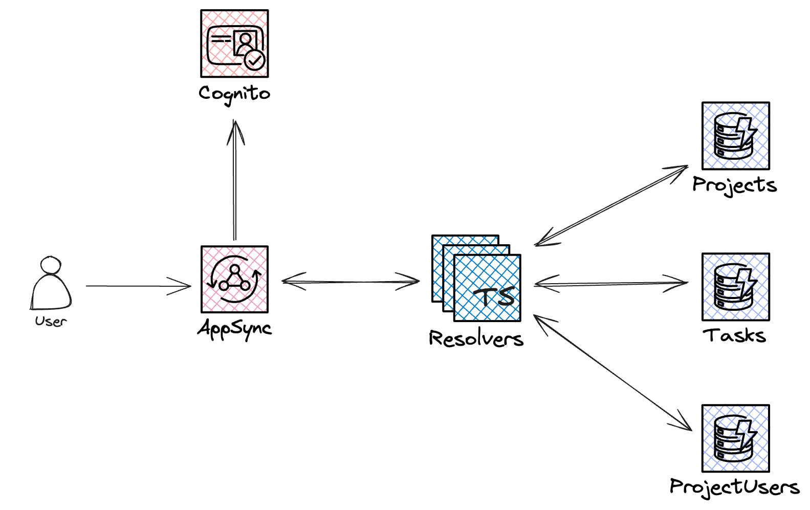
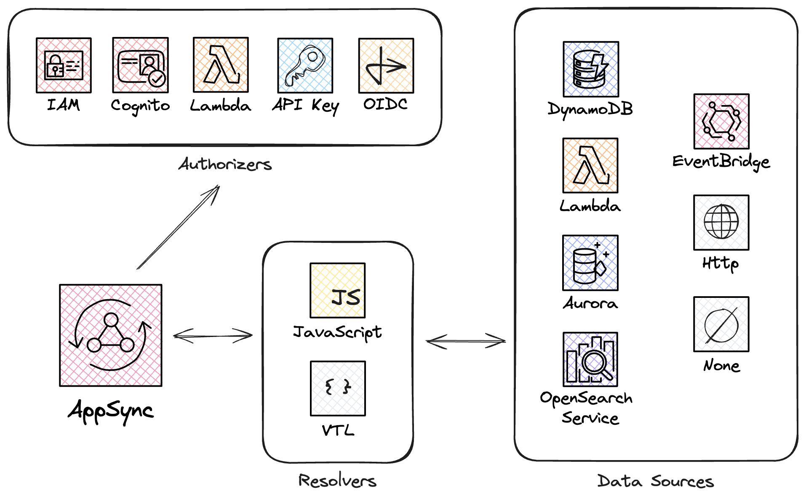

# Build a GraphQL API with AWS AppSync and TypeScript

Welcome! In this workshop, you will learn how to build a fully functional GraphQL API from scratch utilizing serverless technology such as AWS AppSync, Amazon DynamoDB and Amazon Cognito. We will cover aspects like authentication, authorization and real-time pub/sub. To accomplish this, we will use TypeScript as our main programming language, and the Serverless Framework for Infrastructure as Code (IaC). We will use the direct-integration between AppSync and DynamoDB (zero Lambda function required).

The full workshop should take you about 2 hours to complete.

## About the Instructor


Hi 👋, I'm Benoit, a passionate serverless developer with a deep love for serverless technology. As an AWS Community Builder, I actively contribute to the community and share my expertise. You can often hear me promoting AWS AppSync, one of my favourite AWS services. As such, I am the core maintainer of the [serverless-appsync-plugin](https://github.com/sid88in/serverless-appsync-plugin). I am also the creator of this website ([appsync.wtf](https://appsync.wtf)) and [GraphBolt](https://graphbolt.dev). My journey involves creating engaging content about serverless, aiming to simplify and share knowledge within the tech community. Connect with me on Twitter/X [@Benoit_Boure](https://twitter.com/Benoit_Boure).

<div style={{clear: 'both'}}/>

## What Will we Build?

We will create a collaborative task management system where users can create projects and tasks, and receive notifications and updates in real-time. We will use AWS AppSync to build a GraphQL API with pub/sub capabilities as well as its built-in authentication and authorization features and Amazon Cognito to control who can access the API and which operations they can do. Finally, we will also use Amazon DynamoDB as our main data store.



For reference, here are the GraphQL types that will serve as our base.

```graphql
type Task {
  id: ID!
  title: String!
  description: String!
  priority: Int!
  status: Status!
  project: Project!
  assignees: [ID!]!
  createdAt: AWSDateTime!
  updatedAt: AWSDateTime!
}

type Project {
  id: ID!
  name: String!
  description: String!
  createdAt: AWSDateTime!
  updatedAt: AWSDateTime!
}
```

## GraphQL vs REST

GraphQL is an open-source data query and manipulation language for APIs and a query runtime engine. It was created by Facebook in 2012 before being made publicly available in 2015.

GraphQL and REST are two ways to create APIs, however they differ in a few ways.

**Reads and Writes**

REST uses verbs to communicate which operation the client wants to perform (e.g. `GET` for reads, and `PUT`, `POST` or `DELETE` for writes).

GraphQL uses _Queries_ for read operations and _Mutations_ for writes. In addition to that, it disposes of _Subscriptions_ for real-time communication.

**Underfetching and Overfetching**

In REST, **underfetching** occurs when multiple requests are needed to gather all the required data. For example, if you need to fetch a user and his/her last 10 orders, you might need to send the following two requests: `GET /user/123` and `GET /orders?userId=123&limit=10&order=DESC`

Sometimes, those requests might even need to be consecutive. i.e. if the second request requires a value coming from the first one. This leads to increased latency and network overhead.

REST APIs also often send more data than necessary. In our previous example, you might only need the `name` , `avatar` and `email` of the user, but not the `address` and `biography`. REST usually does not offer control on that and returns all the available fields. This is called **overfetching** and it increases the payload size unnecessarily.

GraphQL tries to solve those two issues as it allows the client to query the all the necessary data in a single query, and omit what it doesn't need.

Here is what an equivalent GraphQL request might look like.

```graphql
query {
  # Get a user
  # Only retrieve the name, avatar and email
  getUser(id: "123") {
    id
    name
    avatar
    email
    # last 10 orders of the user
    # Only retrieve the id and date
    orders(limit: 10, order: "DESC") {
      id
      date
    }
  }
}
```

**Real-time**

REST does not have any real-time capability. If you need pub/sub for your API, you will need to build a complete different API (i.e. WebSocket) in parallel.

As mentioned earlier, GraphQL supports *Subscriptions*. You will learn about subscription on the course of this workshop.

## What is AWS AppSync?

AppSync is a fully-managed and serverless service from AWS that allows developers to build scalable GraphQL APIs in no time without having to worry about maintaining servers. AWS AppSync seamlessly integrates with other AWS services such as Amazon DynamoDB, AWS Lambda, Amazon EventBridge, Amazon Aurora, Amazon OpenSearch and Amazon Cognito.



## Will it Cost me Anything?

This workshop involves deploying several resources into your own AWS account. While most of those services have a generous free tier, you might incur some charges. However those services are inexpensive at this scale and cost should remain moderate.

When this workshop is finished, we will also learn how to clean up and remove all the created resources to suppress any possible charges.
